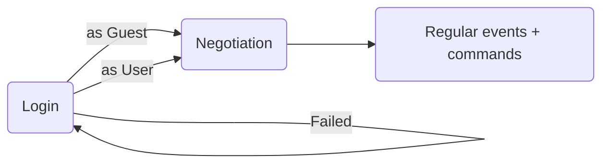

# Collabodraw Canvas Protocol

The Canvas protocol deals with a single canvas. One canvas can have multiple layers, users, and more – and a single WebSocket connection using this protocol represents one active canvas session.

Subprotocol name: `canvas.cd.pixienop.net`

## Overview



## Login

In this phase, the client either tries to login or continues as a guest.

Client login request:
```json
{
    "verb": "login",
    "user": "guest" | <real username>,
    <some form of credentials>  // if not a guest
}
```

Possible server responses:
```json
{
    "verb": "logged in",
    "user": "guest" | <real username>
}
```
```json
{
    "verb": "login failed",
    "message": "Here's the human-readable reason why login failed, and should be displayed to the user.",
}
```

On a failed login the client may be disconnected.

## Negotiation

In this phase, the server and client confirm that they're speaking the same language and pass any relevant info to each other.

1. Details sent once logged-in:
    - Server sends its details to the client. Client ignores unknown keys.
    - Client sends its details to the server. Server ignores unknown keys.
2. Client and server could do extra things here if they want to enable new features or more.
    - This is where clients and servers can define custom protocol extensions.
    - Unknown messages are responded to with the **unknown negotiation message response**.
3. Client and server send each other the `end negotiation` message.
4. Once both the client and server have confirmed negotiation is ended, move to the regular communication phase.

Server details:
```json
{
    "verb": "details",
}
```

Client details:
```json
{
    "verb": "details",
}
```

Unknown negotiation message response:
```json
{
    "verb": "unknown",
    "content": ... original message ...
}
```

End negotiation message:
```json
{
    "verb": "end negotiation"
}
```

## Regular communication

In this phase, the server sends `events` and the client sends `commands`. The client doesn't presume any of their `commands` are accepted, and instead waits for incoming `events` to confirm that they were.

### Syncing the canvas

Syncing the canvas is typically done at the start of a connection, and gives the client the current state of the canvas.

The `sync canvas` message from the server halts delivery of any state changes that haven't yet been sent, and indicates to the client that any prior canvas/undo stack information should be thrown away.

The client sends this command to request a sync of the canvas data:
```json
{
    "verb": "sync canvas"
}
```

The server responds with this set of messages, in this order:
```json
{
    "verb": "sync canvas",
    "layers": [
        ...,
    ],
    ... what to put here ...
}
```
```
one binary frame for each layer, containing a PNG with the layer data
```
```
zero or more changes for each layer, representing the current undo stack on each
```
```json
{
    "verb": "end",
    "state": "sync canvas"
}
```
