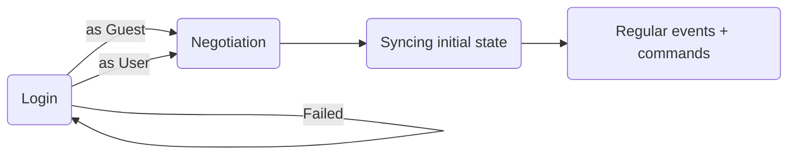

# Collabodraw Canvas Protocol

The Canvas protocol deals with a single canvas. One canvas can have multiple layers, users, and more – and a single WebSocket connection using this protocol represents one active canvas session.

Subprotocol name: `canvas.cd.pixienop.net`

## Overview



## Message details

Communication is primarily done with JSON messages containing objects.

The `verb` defines what the message/command means. If the verb starts with `"end "`, it indicates that this message is ending a state started by another message (ew, make this nicer please).

## Login

In this phase, the client either tries to login or continues as a guest.

Client login request:
```jsonc
{
    "verb": "login",
    "user": "guest or real_username",
    "token": "..."  // if not a guest
}
```

Possible server responses:
```jsonc
{
    "verb": "logged in",
    "user": "guest or real_username"
}
```
```jsonc
{
    "verb": "login failed",
    "message": "Here's the human-readable reason why login failed, and should be displayed to the user.",
}
```

On a failed login the client may be disconnected.

## Negotiation

In this phase, the server and client confirm that they're speaking the same language and pass any relevant info to each other.

1. Details sent once logged-in:
    - Server sends its details to the client. Client ignores unknown keys.
    - Client sends its details to the server. Server ignores unknown keys.
2. Client and server could do extra things here if they want to enable new features or more.
    - This is where clients and servers can define custom protocol extensions.
    - Unknown messages are responded to with the **unknown negotiation message response**.
3. Client and server send each other the `end negotiation` message.
4. Once both the client and server have confirmed negotiation is ended, move to the regular communication phase.

Server details:
```jsonc
{
    "verb": "details",

    // how many actions the server stores, and expects clients to store, on the undo stack for each layer
    "undo_stack_length": 30,
}
```

Client details:
```jsonc
{
    "verb": "details",

    // what the server should send in the initial sync
    "sync": [
        // sends the `sync users` response
        "users",

        // sends the `sync layers` response
        "layers",
    ]
}
```

Unknown negotiation message response:
```jsonc
{
    "verb": "unknown",
    "content": { ... original message ... }
}
```

End negotiation message:
```jsonc
{
    "verb": "end negotiation"
}
```

## Syncing initial state

Before anything else is done, the server sync any information that the user requested in their `details` message.

This is done with the following series of messages:
```jsonc
{
    "verb": "initial state"
}
```
```
all of the initial state messages are sent here
```
```jsonc
{
    "verb": "end initial state"
}
```

## Regular communication

In this phase, the server sends `events` and the client sends `commands`. The client doesn't presume any of their `commands` are accepted, and instead waits for incoming `events` to confirm that they were.

### Syncing the user list

Syncing the user list is typically done at the start of a connection, and gives the client the current list of users.

The client sends this command to request a sync of the user list:
```jsonc
{
    "verb": "sync users"
}
```

The server responds with this message:
```jsonc
{
    "verb": "sync users",
    "users": [
        {
            // if this is true, this object contains the user's own info.
            // otherwise this should be omitted
            "yourself": true,

            "id": "username or unique guest id",
            "name": "Display name here",
            "owner": true or false,

            "color": "#rrggbb",
            "avatar": "https://...",
        },
    ],
}
```

### Syncing the canvas

Syncing the canvas is typically done at the start of a connection, and gives the client the current state of the canvas.

The `sync canvas` message from the server halts delivery of any state changes that haven't yet been sent, and indicates to the client that any prior canvas/undo stack information should be thrown away.

The client sends this command to request a sync of the canvas data:
```jsonc
{
    "verb": "sync canvas"
}
```

The server responds with this set of messages, in this order:
```jsonc
{
    "verb": "sync canvas",
    "name": "Pretty canvas name here",
    "layers": [
        // one entry for each layer, bottom to top
        {
            "id": "...",
            "name": "Display name here",

            // notes:
            //  'id' may be a user not currently in the canvas
            //  'null' layers are unowned and can be taken over by anyone
            "owner": "id" or null,

            "blending_mode": "...",
            "clips_layer_below": true or false,
        },
    ],
}
```
```
one binary frame for each layer, bottom to top, containing a PNG with the layer data
```
```
zero or more changes for each layer, representing the current undo stack
```
```jsonc
{
    "verb": "end sync canvas"
}
```

In other news the server sends the metadata for all layers, then the frame data for all layers, and finally the current undo stack.
