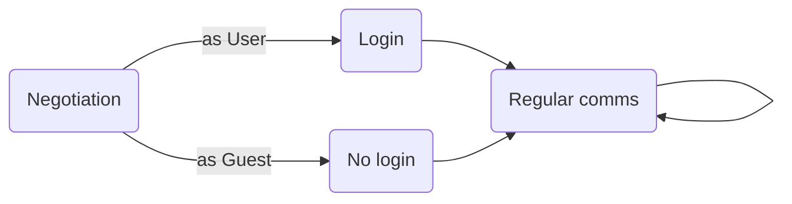

# Collabodraw User Protocol

The User protocol is the primary connection between a Collabodraw interface and the server. It handles login, user state, and creating/removing canvases.

Subprotocol name: `user.cd.pixienop.net`

## Overview



## Negotiation

In this phase, the server and client confirm that they're speaking the same language and pass any relevant info to each other.

1. Server sends its details to the client.
2. Client sends its details to the server.
3. Client and server could do extra things here if they want to enable new features or more. Unknown messages are responded to with the **unknown negotiation message response**.
4. Client and server send each other the `end negotiation` message.
5. Once both the client and server have confirmed negotiation is ended, continue.

Server details:
```json
{
    "verb": "details",
}
```

Client details:
```json
{
    "verb": "details",
}
```

Unknown negotiation message response:
```json
{
    "verb": "unknown",
    "content": ... original message ...
}
```

End negotiation message:
```json
{
    "verb": "end negotiation"
}
```


## Login

In this phase, the client either tries to login or continues as a guest.

Client login request:
```json
{
    "verb": "login",
    "user": "guest" | <real username>,
    <some form of credentials>  // if not a guest
}
```

Possible server responses:
```json
{
    "verb": "logged in",
    "user": "guest" | <real username>
}
```
```json
{
    "verb": "login failed",
    "message": "Here's the human-readable reason why login failed, and should be displayed to the user.",
}
```

## Communication

In this phase, the server sends `events` and the client sends `commands`. The client doesn't presume any of their `commands` are accepted, and instead waits for incoming `events` to confirm that they were.
