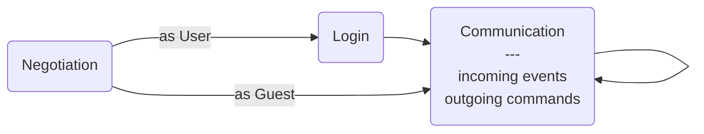

# Collabodraw User Protocol

The User protocol is the primary connection between a Collabodraw interface and the server. It handles login, user state, and creating/removing canvases.

Subprotocol name: `user.cd.pixienop.net`

## Overview

## Negotiation

...

## Login

...

## Communication

...
